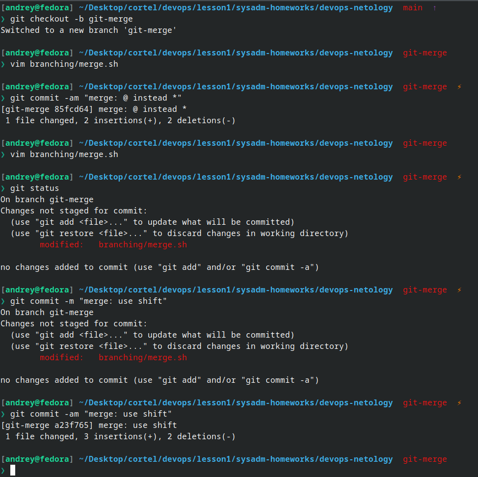
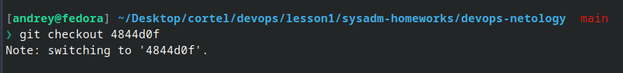
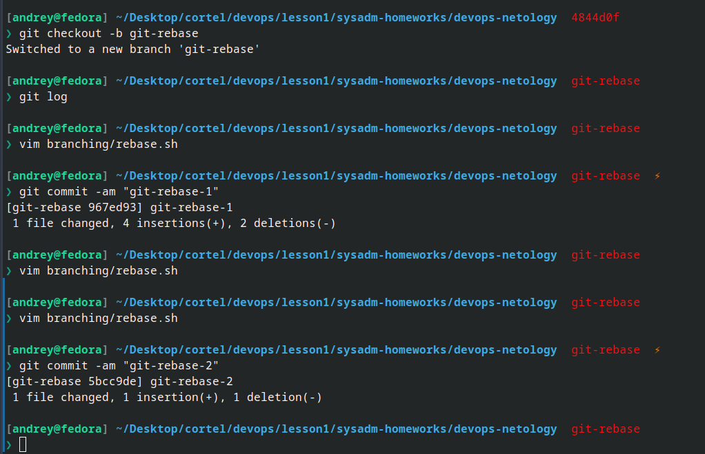
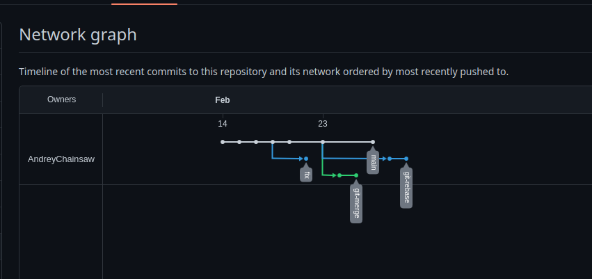
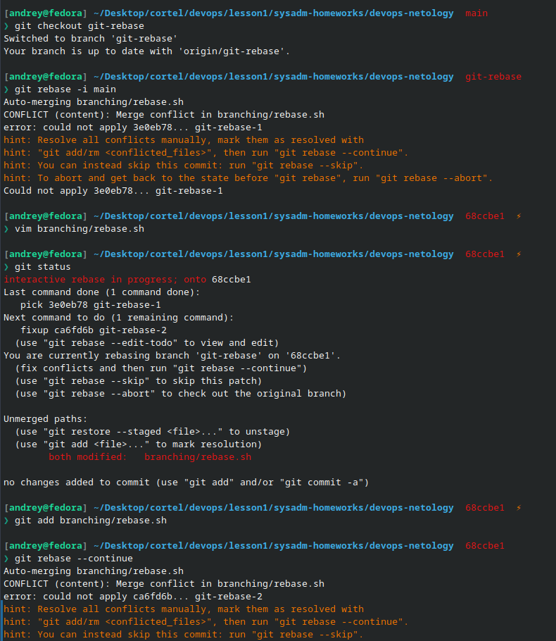
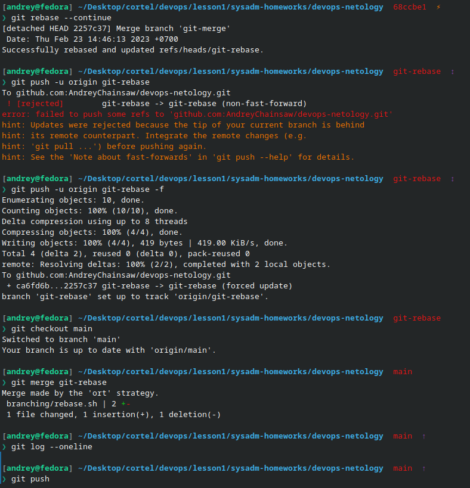

# devops-netology

Редактирую файл README.md любым удобным способом

## Описание .gitignore

### \*\*/.terraform/\*

Игнорировать содержимое директории ` .terraform ` (директория может располагаться в любом месте в рамках проекта)

### \*.tfstate

Игнорировать любые файлы, c расширением ` tfstate ` в любом месте в рамках проекта

### \*.tfstate.\*

Игнорировать файлы, расширения которых начинаются на ` tfstate ` и любая другая последовательность символов после точки

Например:

```

hello.tfstate.foo
random.tfstate.bar

```

### crash.log

Игнорировать файл crash.log в корне с .gitignore

### crash.\*.log

Игнорировать файлы c crash.*любая последовательность символов*.log

### \*.tfvars
 
Игнорировать все файлы с расширением ` tfvars ` во всем проекте

### \*.tfvars.json

Игнорировать все файлы с расширением ` tfvars.json ` во всем проекте


### override.tf и override.tf.json

Игнорировать все файлы с данным названием во всем проекте

### \*\_override.tf \*\_override.tf.json 

Игнорировать все файлы, где имя начинается с любого символа и заканчивается ` _override.tf ` или ` _override.tf.json `

### \.terraformrc и terraform.rc

Игнорировать данные файлы в директории

---
## Занияте 2. Git-branching

1. Создали ветку *git-merge* и переключились, сделали коммиты в ней, запушили в репозиторий командой:

` git push -u origin git-merge `



2. Переключились на коммит *prepare for merge and rebase* и создали новую ветку *git-rebase*, сделали в ней коммиты





3. Промежуточный итог выглядел вот так:



4. Переключились на *main* командой ` git checkout main ` и выполнили merge веток ` git merge git-merge `

5. Выполнили rebase, решая конфликты:



6. Отправили ветку в удаленный репозиторий

