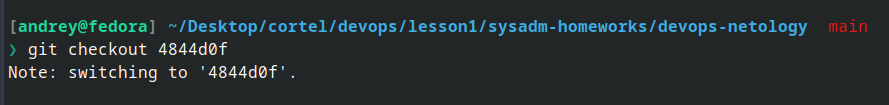

## Занияте 2. Git-branching

1. Создали ветку *git-merge* и переключились, сделали коммиты в ней, запушили в репозиторий командой:

` git push -u origin git-merge `

2. Переключились на коммит *prepare for merge and rebase* и создали новую ветку *git-rebase*, сделали в ней коммиты

3. Промежуточный итог выглядел вот так:

4. Переключились на *main* командой ` git checkout main ` и выполнили merge веток ` git merge git-merge `

5. Выполнили rebase, решая конфликты:

6. Отправили ветку в удаленный репозиторий

